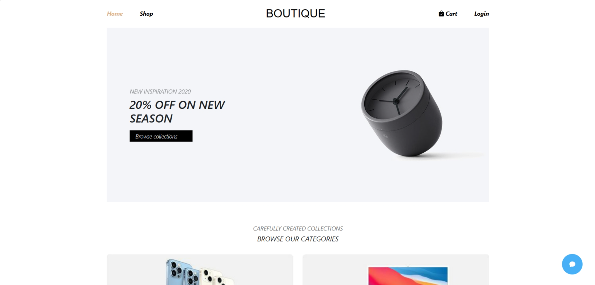

# BOUTIQUE [Under Construction Updating]



## Introduction

Experience unlimited phone shopping at [BOUTIQUE](https://rjs-asm03-nguyenhhkiet.vercel.app/). With a variety of designs, quality and value, we bring you a convenient and reliable online shopping space. Explore the world of smart technology today!

### Description

Main goals of the project:

-   Create a total Layout including NavBar and Footer
-   List of categories
-   List of products
-   Display product detail popup
-   Create a product list view interface
-   Create an interface to view product details
-   Handling account login/registration
-   Add product to cart
-   Create a shopping cart view interface
-   Create Checkout interface
-   Create livechat screen

## Tech Stack

-   ReactJS
-   React-Redux
-   React-Router-Dom
-   Bootstrap

## Features

👉 Home Page: Dynamic home page showcases.

👉 Detail Page: Display detailed room information.

👉 Cart Page: Update the user's shopping cart when adding products, displaying necessary information about price and number of products in the cart.

👉 SignUp/SignIn Page: Seamless onboarding with secure signin and signup functionalities.

👉 Responsive: Full responsiveness across devices for consistent user experience; fluid design adapts seamlessly to various screen sizes, ensuring accessibility.

## Quick Start

Follow these steps to set up the project locally on your machine.

**Prerequisites**

Make sure you have the following installed on your machine:

-   Git
-   Node.js
-   npm (Node Package Manager)

**Installation**

Install the project dependencies using npm:

```javascript
npm install
```

**Running the Project**

```javascript
npm run start
```
